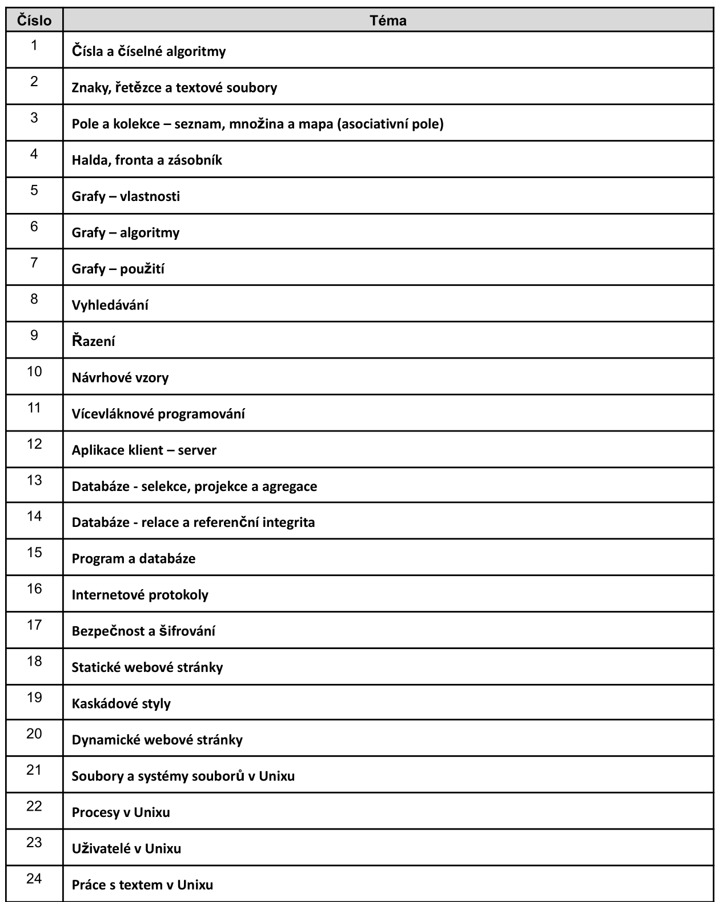

# Maturitní témata z programovaní
---
Ve čtvrtém ročníku mají studenti z programátorských tříd možnost maturity z programovaní.

Zde jsou témata o kterých budou muset maturanti umět hovořit tento rok:

